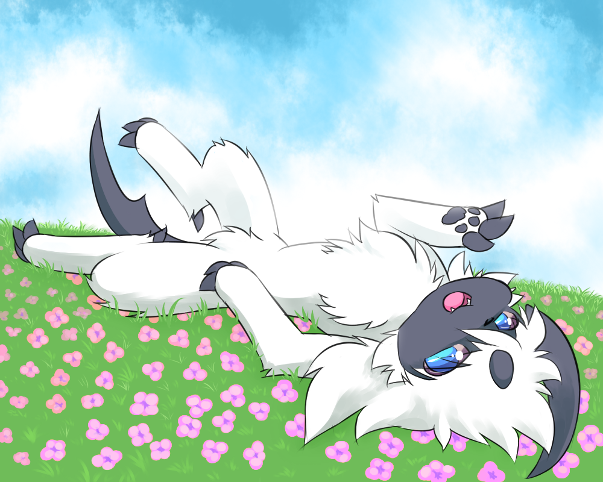
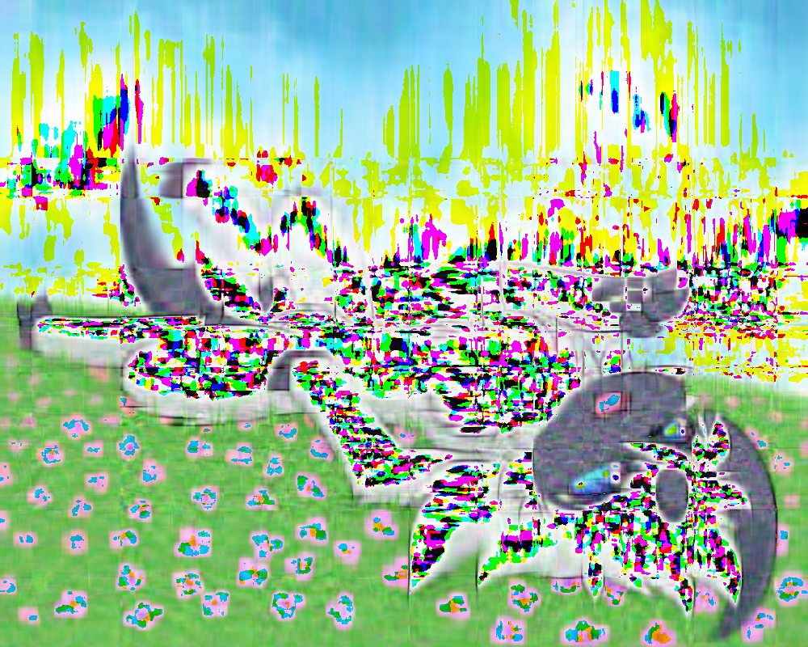
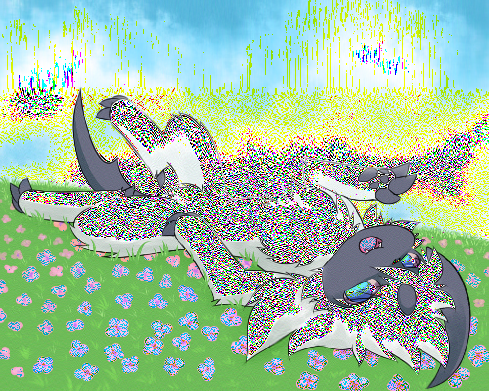

UECM3033 Assignment #2 Report
========================================================

- Prepared by: Connie Liaw Hong Yao
- Tutorial Group: T3

--------------------------------------------------------

## Task 1 --  $LU$ Factorization or SOR method

The reports, codes and supporting documents are to be uploaded to Github at: 

[https://github.com/AlferdFoo/UECM3033_assign2](https://github.com/AlferdFoo/UECM3033_assign2)

Explain your selection criteria here.

In order to choose SOR method, the matrix A must be a positive definite and tridiagonal matrix. If it is not, then LU factorization is the only choice.

Explain how you implement your `task1.py` here.

First, define LU(A,b) and sor(A,b).
Then, give the condition on solve(A,b).
Final, run the system to the step solve(A,b) to choose which method is suitble.

Solution:

Solve by lu(A,b)
[1.0, 1.0, 1.0]
Solve by lu(A,b)
[1.0000000000000067, -0.9999999999999961, 4.000000000000001,
 -3.4999999999999956, 7.0000000000000036, -1.0000000000000004]

---------------------------------------------------------

## Task 2 -- SVD method and image compression

Put here your picture file (beautiful.png)

How many non zero element in $\Sigma$?

800 in r$\Sigma$; 800 in g$\Sigma$; 800 in b$\Sigma$

Put here your lower and better resolution pictures. Explain how you generate
these pictures from `task2.py`.

Change the $\Sigma$, which is matrix s of r, g and b where keep the first 30 non-zero elements and others become 0.
Then multiply with matrices U and V of r, g and b to create newR, newG and newB.
At last, combine the 3 different matrices as a newImage.

Similarly, change the $\Sigma$, which is matrix s of r, g and b but keep the first 200 non-zero elements and others become 0.
Then multiply with matrices U and V of r, g and b to create newR1, newG1 and newB1.
At last, combine the 3 different matrices as a newImage1.

What is a sparse matrix?

A sparse matrix is a matrix in which most of the elements are zero.
-----------------------------------

last modified: 11/3/2016
